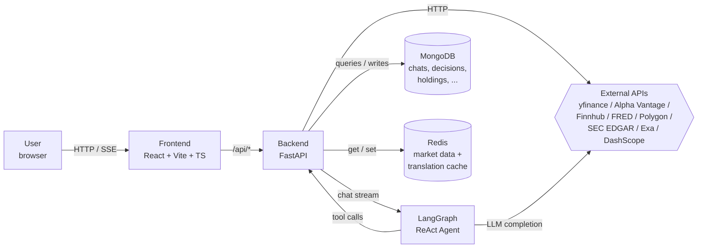
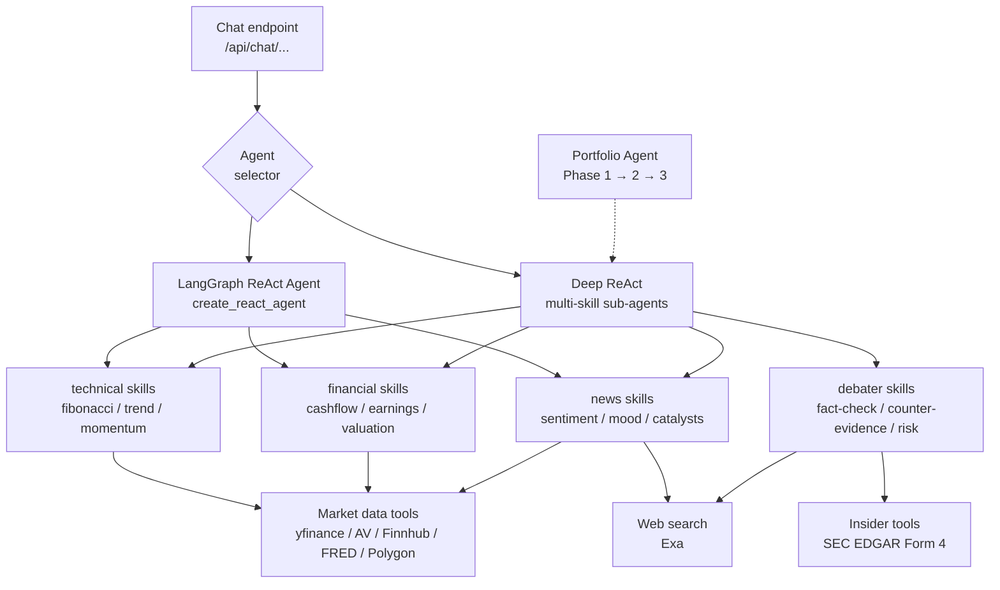
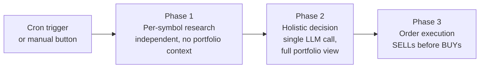

# Architecture Overview

Financial Agent is a single-user, locally-run financial analysis tool. A React
SPA in the browser talks to a FastAPI backend over HTTP / SSE; the backend
delegates LLM-driven analysis to LangGraph ReAct agents, persists chats and
portfolio data to MongoDB, and caches market data and translations in Redis.
External data (yfinance, Alpha Vantage, Finnhub, FRED, Polygon, SEC EDGAR,
Exa) is normalized through a `DataManager` fallback chain. Everything runs
under `docker compose` on a single host.

## 1. High-Level Data Flow



The browser never talks to MongoDB, Redis, or external providers directly.
Authentication has been removed for the personal-local fork; the frontend
attaches a fixed `Authorization: Bearer local` header that the backend's
`require_admin` dependency accepts as a no-op.

## 2. Agent Graph



### Portfolio agent (Phase 1 → Phase 2 → Phase 3)



- **Phase 1** runs one Deep ReAct research pass per symbol, independent of the
  portfolio (so research is reusable across rebalances).
- **Phase 2** consumes all Phase 1 outputs in a single structured LLM call and
  emits a `List[TradingDecision]` with full portfolio visibility.
- **Phase 3** sorts decisions so SELLs execute first (releasing liquidity)
  before BUYs.

This refactor is documented in
[`features/portfolio-agent-architecture-refactor.md`](../features/portfolio-agent-architecture-refactor.md).

## 3. Layered View

```
┌────────────────────────────────────────────────────────────────┐
│ frontend/                                                       │
│   src/components/   React UI                                    │
│   src/services/     axios clients ↔ /api/*                      │
│   src/hooks/        useTranslated, useChat, ...                 │
│   src/i18n/         English + zh-CN; write-time translation     │
└────────────────────────────────────────────────────────────────┘
                              │ HTTP / SSE
┌────────────────────────────────────────────────────────────────┐
│ backend/src/                                                    │
│   api/               FastAPI routers (see api-reference.md)     │
│   agent/             LangGraph ReAct agent + skills/*           │
│   services/          DataManager, portfolio, watchlist,         │
│                      translation, persistence_translator        │
│   core/              config, exceptions, analyzers              │
│   database/          MongoDB / Redis clients + repositories     │
│   models/            Pydantic data models                       │
│   main.py            app factory + middleware + router mount    │
└────────────────────────────────────────────────────────────────┘
```

## 4. Tech Stack

| Layer | Stack |
|---|---|
| Frontend | React 18, TypeScript 5, Vite, TailwindCSS, TanStack Query, react-i18next |
| Backend | Python 3.12, FastAPI, Uvicorn, structlog, Motor (async Mongo), redis-py |
| AI / LLM | LangChain, LangGraph (`create_react_agent`), Alibaba DashScope (Qwen) as the default provider |
| Storage | MongoDB (chats, messages, decisions, holdings, insights), Redis (market quotes + translation cache) |
| Runtime | Docker Compose (single host, local only) |

## 5. Cross-References

- 12-factor design rationale: [`agent-12-factors.md`](agent-12-factors.md)
- ReAct agent implementation details: [`react-agent-integration.md`](react-agent-integration.md), [`react-agent-debugging.md`](react-agent-debugging.md)
- Skill catalog: [`../../backend/src/agent/skills/README.md`](../../backend/src/agent/skills/README.md)
- API reference: [`api-reference.md`](api-reference.md)
- Original architecture proposal (kept for context): [`agent-architecture.md`](agent-architecture.md)
