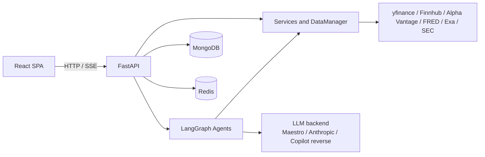

# Architecture Overview

Financial Agent is a local single-user modular monolith. A React SPA calls one
FastAPI process over HTTP and SSE. The backend owns agent orchestration,
financial analysis, external data access, MongoDB persistence, and Redis
caching. Docker Compose starts the frontend, backend, MongoDB, and Redis.

```mermaid
flowchart LR
    browser[React SPA]
    api[FastAPI]
    agents[LangGraph Agents]
    services[Services and DataManager]
    mongo[(MongoDB)]
    redis[(Redis)]
    llm[LLM backend<br/>Maestro / Anthropic / Copilot reverse]
    providers[yfinance / Finnhub / Alpha Vantage / FRED / Exa / SEC]

    browser -- HTTP / SSE --> api
    api --> agents
    api --> services
    agents --> llm
    agents --> services
    services --> providers
    api --> mongo
    api --> redis
```

## Frontend

`frontend/src/App.tsx` renders five local tabs: Health, Chat, Portfolio,
Evaluation, and Insights. TanStack Query manages server state. Chat responses and tool events
arrive through an SSE `POST /api/chat/stream` request.

Quick-analysis buttons call deterministic `/api/analysis/*` routes directly.
Free-form chat sends `agent_version=auto` and the backend selects one of three
flows for each user turn:

- `v2`: direct conversational answer for concepts and summaries
- `v3`: LangGraph ReAct agent for current data and tool-backed analysis
- `v4-deep`: specialist research plus adversarial debate for explicit deep dives

The router applies deterministic rules first and calls a Haiku-class classifier
only for ambiguous requests. It emits and persists a `route_selected` event so
the frontend can explain which flow was chosen and restore that choice later.
Explicit flow values remain available only as debugging/API overrides.

Component versions are declared in [backend package metadata](../../backend/pyproject.toml)
and [frontend package metadata](../../frontend/package.json), not duplicated in
runtime components. Root, Health, OpenAPI, and the Health UI are checked against
these sources by the hardening validation. The versions in this document describe
the current working tree; the active handoff records the last published release.

## Backend

`backend/src/main.py` is the composition root. During startup it connects to
MongoDB and Redis, creates indexes, initializes DataManager, builds the ReAct
and portfolio agents, registers insights, and starts cache warming.

The backend is divided into:

- `api/`: FastAPI routers and request/response schemas
- `agent/`: ReAct, deep-agent, and portfolio decision pipelines
- `services/`: business logic, data providers, translation, and caching
- `database/`: MongoDB/Redis clients and repositories
- `models/`: Pydantic persistence and domain models
- `core/`: configuration, analysis primitives, and shared utilities

## Agent Architecture

The standard ReAct agent uses LangGraph `create_react_agent` with local
LangChain tools. A full initialization currently registers approximately 24
tools covering technical analysis, fundamentals, quotes, news, market
insights, options PCR, and insider data.

Conversational history is owned by MongoDB. Each request persists its current
user message, prepares token-bounded prior history by message ID, and invokes a
stateless per-request ReAct graph. LangGraph manages the tool loop within that
request; it is not used as the cross-request conversation store.

`llm_factory.py` selects a model client with
`LLM_PROVIDER=maestro|anthropic|copilot_reverse|github_copilot`. Native
`github_copilot` uses an independent local OAuth store and Python adapters for
Responses and Chat Completions, preserving LangChain tools/streaming/structured output
without a bridge. Account-permitted GPT/Gemini/Grok models are supported; MAI is excluded.
Health provides explicit login, default/role model selection, versioned presets, tests
and local logout. Runs freeze role/model/protocol mappings; Portfolio Phase1/Phase2,
translation and consistency checks use their real logical roles. Model diversity is
not itself evidence of investment effectiveness. Other modes retain their existing
Anthropic-compatible transport. Agent Maestro keeps the
cross-vendor role mapping. Direct Anthropic uses one configured Anthropic model.
Copilot reverse mode targets the sibling `copilot-bridge` at `/cc` and uses
Claude models for the main/tool-heavy roles and GPT Responses models for
financial research, adversarial review, and summarization. Gemini routing is
not enabled because the bridge's OpenAI Chat strategy is not implemented yet.

The deep agent runs specialist research, challenges it with independent
yfinance/web-search evidence, and synthesizes a final verdict. Research starts
only after the requested symbol has been validated. Ambiguous or missing
symbols pause at a persisted clarification card instead of silently selecting a
default company. Follow-up Deep requests receive a bounded structured context
containing the prior thesis, confirmed symbol, investment horizon, risk
tolerance, and explicit constraints; the full raw transcript is not copied
into every specialist prompt.

## Portfolio Pipeline

The dashboard exposes two main flows:

1. Analyze existing holdings.
2. Filter a sector universe and generate today's candidate picks.

Both flows run independent Phase 1 research, a consistency gate, and a
portfolio-aware Phase 2 structured decision. Actionable results are persisted
as local suggestions. No broker API is called.

## Data and Storage

DataManager centralizes provider fallback and Redis caching:

- quotes: Finnhub when configured, then yfinance, then Alpha Vantage
- OHLCV: yfinance, then Alpha Vantage
- Treasury data: FRED, then Alpha Vantage
- news and insider data: provider-specific fallback chains

MongoDB stores chats, messages, holdings, watchlists, transactions, decisions,
tool executions, settings, and insight snapshots. Redis stores short-lived
market data, insight caches, translations, and request-deduplication locks.

## Localization

Static UI strings use i18next. Analysis output is generated in English,
translated before persistence when possible, and stored in `_zh` companion
fields. The frontend falls back to the cached `/api/translate` endpoint when a
precomputed translation is unavailable.
