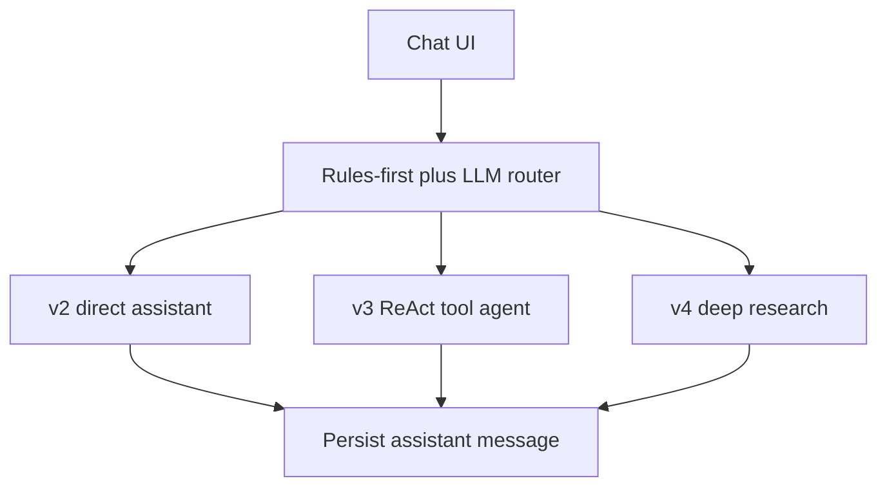
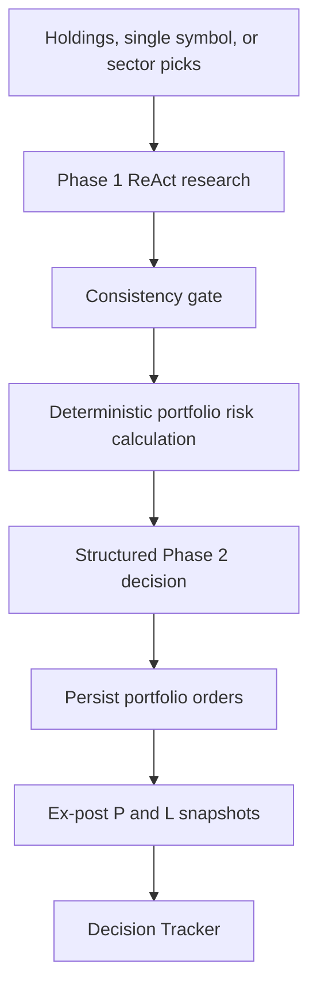
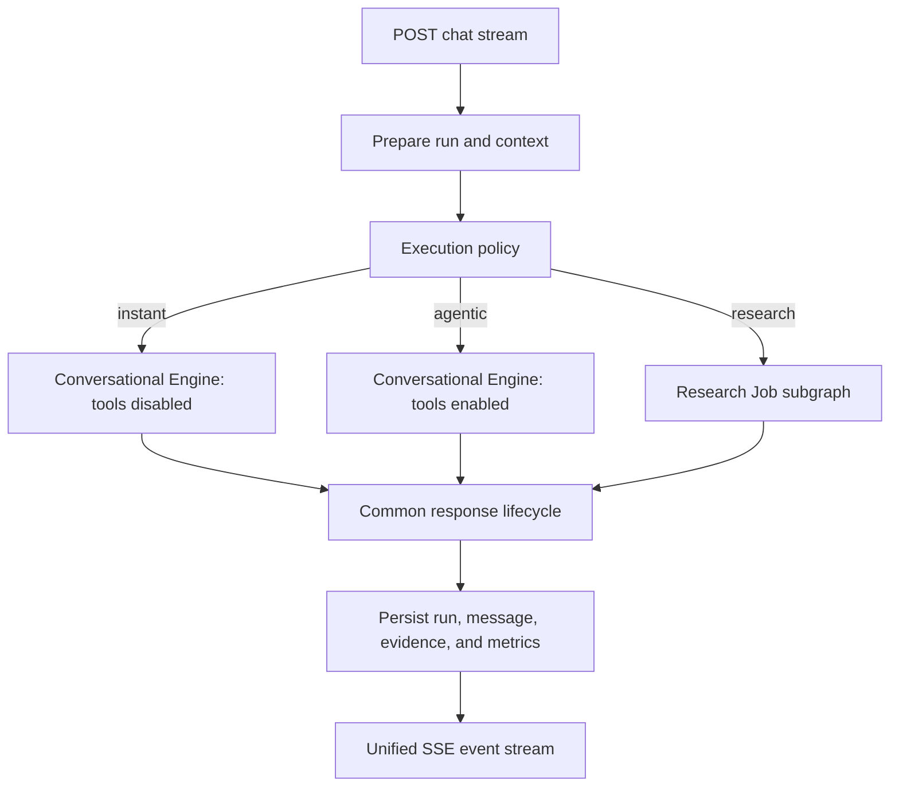

# Unified Agent Workflow Improvement Roadmap

## 1. Executive Decision

The product should expose one financial assistant rather than three user-facing
agent versions. The current `v2`, `v3`, and `v4-deep` implementations represent
execution strategies, not product versions.

The target architecture keeps one chat entry point and two execution engines:

1. **Conversational Engine**
   - answers simple requests directly;
   - enables tools when current or external data is required;
   - uses one shared streaming, persistence, cancellation, and error lifecycle.
2. **Research Job**
   - runs long-lived specialist research, adversarial review, and verdict
     synthesis;
   - supports durable progress, cancellation, checkpointing, and resume;
   - is invoked automatically when request complexity requires it.

The internal execution mode becomes:

```text
instant | agentic | research
```

`v2`, `v3`, and `v4-deep` remain temporary compatibility aliases during
migration and are removed after callers, tests, persisted metadata, and
documentation have moved to the new contract.

## 2. Goals

- Present one coherent assistant experience to the user.
- Preserve cheap and low-latency handling for simple questions.
- Preserve autonomous tool use for current financial information.
- Preserve deep multi-stage research as a distinct long-running workflow.
- Make routing, prompts, tools, data sources, costs, and decisions observable.
- Make agent quality measurable through repeatable evaluations.
- Establish one explicit source of truth for conversation and graph state.
- Eliminate silent fallbacks that can produce confident but incorrect output.
- Keep deterministic financial calculations outside the LLM.
- Retain the local, single-user deployment model.

## 3. Non-Goals

The roadmap does not add:

- multi-user authentication or authorization;
- cloud deployment or horizontal scaling;
- broker execution or automatic trading;
- credit billing;
- unnecessary agents around deterministic calculations;
- a fully autonomous system that can make irreversible financial actions.

Security, CI, and distributed-runtime improvements are included only where they
improve local reliability, interview credibility, or future maintainability.

## 4. Current Workflow Inventory

### 4.1 Free-Form Chat



- `v2` performs direct conversational generation and real token streaming.
- `v3` runs a LangGraph ReAct loop with financial tools.
- `v4-deep` runs specialist research, debate, and verdict synthesis.
- The router emits `route_selected` and persists its decision.
- Quick-analysis buttons bypass the router and call deterministic APIs.

### 4.2 Portfolio Analysis



This is the strongest existing workflow because it separates:

- evidence collection by an agent;
- data-quality criticism by a second model;
- numeric risk calculation by deterministic Python;
- judgment generation through structured output;
- outcome tracking through persisted decisions and later P&L snapshots.

### 4.3 Deterministic Workflows

The following should remain deterministic services rather than becoming
agents:

- Fibonacci, stochastic, fundamentals, cash-flow, and balance-sheet buttons;
- portfolio CRUD and summary calculations;
- market-insight metrics, scores, and trend history;
- provider fallback, cache lookup, and data normalization;
- portfolio concentration, beta, correlation, and volatility calculations.

Agents may call these capabilities, but they should not reimplement their
logic.

## 5. Target Architecture



### 5.1 One Public Contract

The frontend sends normal user intent and context:

```json
{
  "message": "Compare AAPL and MSFT using current fundamentals",
  "chat_id": "chat_123",
  "current_symbol": "AAPL",
  "language": "zh-CN"
}
```

The frontend does not send an agent version. Explicit execution overrides may
remain available through a debug-only header or test dependency override.

### 5.2 Internal Execution Decision

The selected policy should be represented by a stable schema:

```json
{
  "execution_mode": "agentic",
  "reason_code": "current_financial_data",
  "source": "rule",
  "policy_version": "2026-07-01"
}
```

The policy controls:

- allowed tools;
- model role;
- maximum tokens;
- maximum tool calls;
- execution timeout;
- whether a background research job is required;
- whether clarification is required before execution.

### 5.3 Two Engines, Not Three Versions

The direct-answer and tool-agent paths share one Conversational Engine. The
difference is an execution policy:

```text
instant:
  tools = disabled
  latency budget = low
  cost budget = low

agentic:
  tools = selected financial tool set
  latency budget = medium
  cost budget = medium
```

The Research Job remains separate because it has a different lifecycle:

- parallel or staged specialist work;
- debate rounds;
- progress events;
- longer timeout;
- durable checkpointing;
- explicit cancellation and resume;
- partial-result persistence.

## 6. Priority 0: Correctness and Trust

These changes should be completed before presenting the system as reliable.

### 6.1 Remove Silent AAPL Fallback

**Problem**

The deep-agent symbol extractor defaults to `AAPL` when extraction fails. This
can generate a plausible but completely unrelated financial report.

Detailed implementation plan:
[UAW-001: Deep Agent Symbol Clarification](../features/deep-agent-symbol-clarification.md).

Implementation status: shipped in commit `7c17021`.

**Required behavior**

- Return a typed `symbol_required` result.
- Include the ambiguous user text and candidate symbols when available.
- Ask the frontend to request clarification.
- Do not call research tools until the symbol is confirmed.

**Acceptance criteria**

- Unknown company names never start an AAPL analysis.
- Ambiguous names produce a clarification event.
- Chinese company names and ticker aliases are covered by evaluation cases.

**Primary paths**

- `backend/src/agent/deep_agent_adapter.py`
- `backend/src/api/chat/streaming/deep_agent.py`
- `frontend/src/components/EnhancedChatInterface.tsx`

### 6.2 Choose One Conversation-State Authority

**Problem**

Before UAW-002, the ReAct agent created a new LangGraph `thread_id` for each
invocation while also replaying conversation history from MongoDB.
`MemorySaver` therefore did not provide cross-turn continuity.

Detailed implementation plan:
[UAW-002: Mongo-Authoritative Conversation State](../features/mongo-authoritative-conversation-state.md).

Implementation status: shipped in commit `9fe9a8e`.

Changing only the thread ID is unsafe because LangGraph state and manually
replayed Mongo history could duplicate messages.

**Decision required**

Use one of these designs:

1. **Mongo-authoritative**
   - MongoDB stores conversation history.
   - Each invocation receives a bounded, compacted history.
   - Remove `MemorySaver` and checkpointing claims from the conversational
     agent.
2. **Graph-authoritative**
   - A persistent checkpointer is keyed by `chat_id`.
   - The graph resumes its own messages and state.
   - MongoDB stores user-visible messages and run metadata, but does not replay
     the complete history into an already-resumed graph.

For the current local modular monolith, Mongo-authoritative conversation state
is the simpler default. Durable graph checkpoints should be introduced first
for the long-running Research Job, where resume provides clear value.

**Acceptance criteria**

- Multi-turn answers use prior context exactly once.
- Restart behavior is documented and tested.
- The code and documentation no longer claim unused memory behavior.

### 6.3 Give Research Real Context

**Problem**

The deep adapter accepts `conversation_history` but does not pass it into the
research graph. Follow-up questions therefore lose prior assumptions,
constraints, and conclusions.

Detailed implementation plan:
[UAW-003: Deep Research Conversation Context](../features/deep-research-conversation-context.md).

Implementation status: shipped in commit `95631fc`.

**Required behavior**

- Build a compact research context from relevant prior turns.
- Store confirmed symbol, user constraints, investment horizon, and risk
  tolerance as structured state.
- Do not inject the full raw transcript into every specialist prompt.

**Acceptance criteria**

- “Now challenge that thesis” refers to the immediately preceding report.
- “Use the same horizon but compare MSFT” preserves the prior horizon.
- Research state remains below its configured context budget.

### 6.4 Fix Watchlist Persistence Wiring

**Problem**

The single-symbol analysis path updates `watchlist_items`, while the repository
uses the `watchlist` collection elsewhere. Existing mocked tests do not verify
the collection name.

**Required behavior**

- Use one collection constant or repository factory.
- Add an integration-level test that observes the actual collection call.
- Remove broad exception handling that makes wiring errors appear cosmetic.

**Acceptance criteria**

- A successful watchlist analysis updates `last_analyzed_at`.
- The dashboard immediately displays the updated timestamp.
- A collection mismatch fails a test.

### 6.5 Cancel Orphaned Agent Work

**Problem**

Closing the frontend request aborts the browser stream but does not reliably
cancel the backend ReAct or research task. Tool calls and model calls may
continue after the user has stopped the request.

**Required behavior**

- Detect client disconnect or generator cancellation.
- Cancel the active task and await its termination.
- Persist a cancelled run status rather than an error-shaped response.
- Propagate cancellation into child research tasks where supported.

**Acceptance criteria**

- Stopping a request prevents further tool events.
- The run record ends as `cancelled`.
- Cancellation does not leave background tasks or locked run records.

### 6.6 Make Streaming Semantics Honest

**Problem**

The current ReAct and deep handlers generate the full final answer and then
split it into ten-character chunks. This is a typewriter effect, not model
token streaming.

**Required behavior**

- Rename metrics and documentation so simulated chunks are not reported as
  model time-to-first-token.
- Prefer true synthesis streaming when the model client supports it.
- Keep progress and tool events independent from final-answer token streaming.

**Acceptance criteria**

- `first_model_token` measures an actual model stream.
- If true streaming is unavailable, the event is named
  `first_response_chunk`.
- Documentation explicitly distinguishes progress streaming from token
  streaming.

## 7. Priority 1: Unified Runtime

### 7.1 Introduce a Shared Run Model

Every user request should create a durable run record:

```text
run_id
chat_id
execution_mode
policy_version
prompt_versions
model_routes
status
started_at
finished_at
tool_calls
input_tokens
output_tokens
estimated_cost
data_sources
data_freshness
error_code
cancel_reason
```

Suggested statuses:

```text
pending | running | waiting_for_input | completed | failed | cancelled
```

This run record should be the common observability boundary for instant,
agentic, research, and portfolio analysis.

### 7.2 Unify Chat Handler Lifecycle

Extract one shared lifecycle for:

1. request validation;
2. run creation;
3. context preparation;
4. policy selection;
5. engine execution;
6. progress and response events;
7. token and cost accounting;
8. assistant-message persistence;
9. title update;
10. completion, failure, or cancellation.

The execution engines should return typed events instead of each handler
reimplementing SSE formatting, persistence, timeout, and exception behavior.

### 7.3 Standardize Agent Events

Use one event envelope:

```json
{
  "run_id": "run_123",
  "sequence": 8,
  "type": "tool_completed",
  "timestamp": "2026-07-15T08:00:00Z",
  "payload": {}
}
```

Core event types:

```text
run_started
policy_selected
clarification_required
model_started
tool_started
tool_completed
research_stage_started
research_stage_completed
response_chunk
run_completed
run_failed
run_cancelled
```

Events should have monotonically increasing sequence numbers so the frontend
can deduplicate or replay them.

### 7.4 Add Idempotency

Duplicate clicks and network retries must not create duplicate messages or
duplicate expensive research jobs.

- Accept a client-generated request ID.
- Store an idempotency record for the request.
- Return or resume the existing run when the same request is retried.

## 8. Priority 1: Agent Evaluation

The project needs a repeatable answer to:

> How do we know a model, prompt, router, or tool change did not regress the
> agent?

### 8.1 Evaluation Layers

#### Layer A: Deterministic Unit Tests

- router rules;
- symbol normalization;
- risk calculations;
- cache/provider ordering;
- event schema;
- run-state transitions;
- cancellation cleanup.

#### Layer B: Golden Agent Cases

Store versioned cases containing:

```text
input
frontend context
expected execution mode
required tools
forbidden tools
required facts or evidence
expected structured fields
maximum latency and cost class
```

Initial dataset:

- 20 instant conceptual requests;
- 20 agentic current-data requests;
- 15 deep-research requests;
- 15 ambiguous or adversarial requests;
- Chinese and English variants;
- missing-symbol and ambiguous-symbol cases.

#### Layer C: Model-Based Quality Scoring

Use an independent evaluator model with explicit rubrics:

- factual grounding;
- evidence coverage;
- citation or source consistency;
- relevance;
- completeness;
- uncertainty disclosure;
- contradiction handling;
- financial-risk language;
- actionability without overstating certainty.

Evaluator output must be structured and include quoted evidence for failed
criteria.

#### Layer D: Financial Outcome Evaluation

Use persisted decisions and P&L snapshots to calculate:

- hit rate by 7/30/90-day horizon;
- average and median return;
- high-confidence versus low-confidence calibration;
- BUY/SELL/HOLD confusion-style outcomes;
- performance by recommendation source;
- performance by model and prompt version;
- performance by full versus degraded pipeline.

This is retrospective measurement, not proof of future investment performance.

### 8.2 Evaluation Gates

Before changing a model or prompt:

- router accuracy must not regress beyond an agreed threshold;
- tool-selection precision must remain above threshold;
- unknown-symbol safety cases must remain at 100%;
- deterministic financial tests must remain exact;
- aggregate quality score must not regress without an explicit waiver;
- estimated cost and p95 latency changes must be reported.

## 9. Priority 1: Prompt, Model, and Cost Governance

### 9.1 Prompt Registry

Move significant prompts behind stable names and versions:

```text
router@1
react-system@3
symbol-extraction@2
deep-planner@1
deep-debater@2
deep-verdict@1
portfolio-phase2@4
consistency-gate@2
```

Every run records the exact prompt version. Prompt changes require related
golden evaluations.

### 9.2 Structured Outputs

Use Pydantic structured output for:

- routing decisions;
- symbol resolution;
- research plan;
- debate concerns;
- verdict summary;
- portfolio recommendations;
- consistency-gate results;
- clarification requests.

Free-form Markdown remains appropriate for the final user response, but
machine decisions should not depend on regex parsing.

### 9.3 Enforce Budgets

Existing token budgets should become executable policy:

- maximum input and output tokens;
- maximum tool calls;
- maximum research stages;
- maximum debate rounds;
- maximum wall-clock duration;
- maximum concurrent symbol analyses;
- estimated cost ceiling.

The deep graph already caps debate rounds. The remaining limits should be
enforced at the shared run layer and reported in the run record.

### 9.4 Model and Provider Failures

- Retry only transient failures.
- Do not retry invalid requests or structured-output validation failures
  indefinitely.
- Record every fallback in the final run metadata.
- Consider cross-provider fallback only after evaluations prove behavioral
  compatibility.
- Never silently change to a cheaper or different model without recording it.

## 10. Priority 1: Evidence and Data Quality

### 10.1 Evidence Envelope

Every important claim should be traceable to:

```text
source
provider
symbol
retrieved_at
market_timestamp
value
unit
freshness
degraded flag
tool_call_id
```

The final response does not need to expose all metadata, but the run trace
should retain it.

### 10.2 Data Freshness Policy

Define freshness by data type rather than using one generic cache claim:

- quotes;
- OHLCV;
- news;
- fundamentals;
- macroeconomic series;
- insider activity;
- insight snapshots.

Update documentation that currently describes quote caching as approximately
30 seconds while the configured quote TTL is five minutes.

### 10.3 External-Content Isolation

News, filings, and web-search results are untrusted data, not instructions.

- Delimit tool results as external evidence.
- Instruct models not to follow commands found inside evidence.
- Strip or flag suspicious prompt-like content.
- Add prompt-injection evaluation cases.

## 11. Priority 1: Portfolio Workflow Improvements

### 11.1 Preserve the Hybrid Design

Do not convert deterministic risk computation into another LLM agent. The
preferred pipeline remains:

```text
agent research
  -> consistency review
  -> deterministic risk calculation
  -> structured decision
  -> outcome tracking
```

The interview value comes from choosing the correct boundary between
probabilistic reasoning and deterministic computation.

### 11.2 Remove Service Duplication

The portfolio API and `PortfolioService` currently contain overlapping
business logic. Select one authoritative service layer and route all holdings
operations through it.

**Acceptance criteria**

- one implementation of create, merge, update, delete, and price refresh;
- no dead dependency factory;
- repository access remains behind the service boundary;
- API tests and service tests describe the same behavior.

### 11.3 Make Holding Merge Atomic

Replace read-modify-write symbol merging with an atomic MongoDB upsert or
transaction-safe operation.

Add a concurrency test that submits two updates for the same symbol and
verifies the final quantity and average cost.

### 11.4 Record Pipeline Quality

Every portfolio decision should include:

```text
pipeline_mode: full | degraded | fallback
research_completed
consistency_gate_result
risk_metrics_available
data_quality_flags
prompt_versions
model_routes
```

The UI must distinguish full-pipeline decisions from simplified fallback
decisions.

### 11.5 Provider Circuit Breakers

The agent-tool layer already has circuit-breaker behavior, but REST-facing
DataManager fallback paths repeatedly call unavailable providers after cache
misses.

Apply a shared provider-health policy to both agent tools and API services:

- short-lived open state after repeated provider failures;
- half-open probes;
- explicit degraded-provider metadata;
- fallback latency metrics.

### 11.6 Outcome Evaluation

The Decision Tracker should become an evaluation surface rather than only a
history table.

Display:

- sample size;
- decision age;
- horizon coverage;
- confidence calibration;
- performance by pipeline mode;
- performance by model and prompt version;
- unavailable or insufficient-data warnings.

## 12. Priority 2: Research Job Reliability

### 12.1 Durable Research Checkpoints

Persist research state after meaningful stages:

```text
symbol_confirmed
plan_created
specialist_research_completed
debate_round_completed
verdict_completed
```

A process restart should be able to resume from the latest safe checkpoint
without repeating completed expensive work.

### 12.2 Partial Results

Partial SSE events are useful for UI reconstruction but are not equivalent to
graph-state replay.

Store both:

- immutable user-visible events for replay;
- structured graph state for execution resume.

### 12.3 Human-in-the-Loop

Research may pause when:

- the symbol is ambiguous;
- required data is unavailable;
- conflicting evidence materially changes the interpretation;
- the user requests an action that would exceed the product's advisory scope.

The graph should persist `waiting_for_input` and resume after the user replies.

## 13. Priority 2: Frontend Experience

### 13.1 One Assistant Identity

Remove all remaining version terminology from normal UI copy. Display
capability and progress instead:

```text
Answering directly
Checking current data
Running deep research
Reviewing counterarguments
Preparing verdict
```

### 13.2 Clarification UI

Render structured clarification prompts with candidate choices rather than
showing generic errors.

### 13.3 Research Job Controls

Long-running research needs:

- progress stage;
- elapsed time;
- cancel button;
- resumable history;
- clear partial-result state;
- notification when background work completes.

### 13.4 Data Provenance

Allow users to inspect:

- data source;
- retrieval time;
- degraded or fallback provider;
- tool used;
- major evidence supporting the conclusion.

## 14. Testing Plan

### 14.1 Chat Runtime Tests

Add handler-level tests for:

- instant response;
- tool-agent response;
- research escalation;
- clarification-required response;
- timeout;
- cancellation;
- queue overflow;
- persistence failure;
- duplicate request ID;
- replay ordering;
- malformed structured output.

### 14.2 Research Tests

- checkpoint and resume;
- cancelled child tasks;
- conversation-context propagation;
- ambiguous symbol;
- maximum budget reached;
- partial specialist failure;
- debate termination;
- verdict generation with degraded evidence.

### 14.3 Portfolio Tests

- actual watchlist collection wiring;
- atomic holding merge;
- full versus fallback pipeline metadata;
- provider circuit-breaker state;
- consistency-gate correction;
- deterministic risk metrics;
- P&L snapshot aggregation and confidence calibration.

### 14.4 Evaluation Tests

Separate deterministic CI tests from live-model evaluations:

- deterministic tests run on every change;
- mocked contract tests run on every pull request;
- live golden evaluations run manually or on an explicit workflow;
- evaluation reports are stored as artifacts, not committed secrets.

### 14.5 Playwright Browser E2E

Every user-facing workflow task requires Playwright coverage. The browser test
must exercise the frontend interaction rather than calling the API directly.

Each task should include:

- deterministic browser tests using network fixtures for rare or ambiguous
  states;
- at least one real local frontend-to-backend scenario for the primary
  integration boundary;
- assertions for visible state, network behavior, and prohibited side effects;
- stable `data-testid` selectors;
- a fixed viewport and disabled animations.

The repository should provide:

```text
frontend/playwright.config.ts
frontend/e2e/
npm run test:e2e
make test-e2e
```

A dedicated Playwright Docker Compose profile is preferred so Chromium and its
system dependencies do not have to be installed in the Alpine frontend
container.

### 14.6 Screenshot Evidence

Playwright traces, reports, videos, and failure screenshots remain raw test
artifacts. In addition, each completed workflow task must save selected
acceptance screenshots under:

```text
docs/features/assets/<task-id>/
```

Evidence requirements:

- use stable, descriptive filenames;
- capture only after the corresponding assertions pass;
- mask timestamps, random identifiers, or sensitive values;
- record whether the scenario used mocks or the real local stack;
- link the screenshots from the task implementation document;
- include the tested commit hash when the task ships.

## 15. Observability Requirements

Minimum metrics:

- route or execution-mode distribution;
- clarification rate;
- tool-selection rate;
- tool success and latency;
- model latency;
- time to first progress event;
- time to first real response token;
- total run latency;
- cancellation rate;
- fallback rate;
- token usage;
- estimated cost;
- evaluation score by prompt/model version;
- portfolio outcome metrics.

Langfuse may remain optional. The local application must still persist enough
structured run metadata to investigate a failed execution without Langfuse.

## 16. Migration Plan

### Phase 0: Establish a Clean Baseline

- Commit the current automatic-routing implementation.
- Record current backend and frontend versions.
- Capture representative chat and portfolio workflows.
- Add known limitations to the roadmap rather than hiding them.

### Phase 1: Correctness Fixes

- remove AAPL fallback;
- fix watchlist collection wiring;
- propagate research context;
- choose conversation-state authority;
- add backend task cancellation;
- correct streaming terminology.

### Phase 2: Unified Contracts

- add `execution_mode`;
- add run records and common event envelopes;
- add prompt and policy versions;
- add idempotency and run-state transitions;
- keep version aliases for compatibility.

### Phase 3: Merge v2 and v3 Runtime

- extract the shared chat lifecycle;
- run direct and tool-capable policies through the Conversational Engine;
- remove duplicate persistence, timeout, and streaming code;
- migrate frontend route badges to capability/progress labels.

### Phase 4: Research Job

- make deep research a durable subgraph;
- add checkpoints, cancellation, resume, and clarification;
- separate event replay from execution state;
- enforce research budgets.

### Phase 5: Evaluation and Governance

- add golden datasets and scoring;
- add prompt registry;
- add model/prompt comparison reports;
- enforce quality, latency, and cost gates.

### Phase 6: Portfolio Consolidation

- fix service duplication and atomic merges;
- add pipeline-quality metadata;
- unify provider circuit breakers;
- turn Decision Tracker into an evaluation dashboard.

### Phase 7: Remove Compatibility Versions

- stop accepting `agent_version` from normal callers;
- migrate persisted metadata where useful;
- remove `v2`, `v3`, and `v4-deep` terminology;
- mark the automatic-routing feature documentation as superseded by the
  unified workflow implementation when migration ships.

## 17. Definition of Done

The unified workflow is complete when:

- users interact with one assistant and never select an agent version;
- simple questions do not pay tool-agent or research cost;
- current-data questions use tools rather than unsupported model memory;
- deep research is cancellable, resumable, and context-aware;
- unknown symbols require clarification and never default silently;
- one state authority prevents duplicated conversation context;
- every run records execution policy, model, prompt, tools, tokens, latency,
  data quality, and outcome;
- model and prompt changes have repeatable evaluation reports;
- portfolio decisions distinguish full, degraded, and fallback pipelines;
- every user-facing workflow has Playwright coverage and linked screenshot
  evidence;
- documentation matches actual checkpointing and streaming behavior.

## 18. Interview Positioning

The strongest accurate description is:

> Financial Agent is a hybrid financial-research system with one adaptive
> assistant entry point. It selects between direct response, tool-backed ReAct
> analysis, and durable deep research based on request complexity. Portfolio
> decisions combine agent-collected evidence, an LLM consistency check,
> deterministic quantitative risk calculations, structured recommendations,
> and retrospective outcome tracking.

Avoid claiming:

- every workflow is multi-agent;
- all financial insight is generated by AI;
- current deep research already supports durable checkpoint resume;
- typewriter chunks are model token streaming;
- tracked decisions have proven investment performance without sufficient
  samples and evaluation reports;
- the local single-user tool is a production multi-tenant platform.

The key architectural story is not the number of agents. It is the deliberate
choice of when to use:

- direct generation;
- autonomous tool use;
- multi-stage research;
- deterministic computation;
- structured validation;
- human clarification;
- retrospective evaluation.

## 19. Deferred Improvements

These remain valid but are lower priority for the current local project:

- automatic cross-provider model failover;
- distributed rate limiting;
- multi-instance circuit-breaker state;
- cloud-secret management;
- multi-user authorization;
- full CI enforcement of every pre-commit security hook;
- broker integrations;
- production autoscaling.

They should be reconsidered only if the deployment scope changes.
