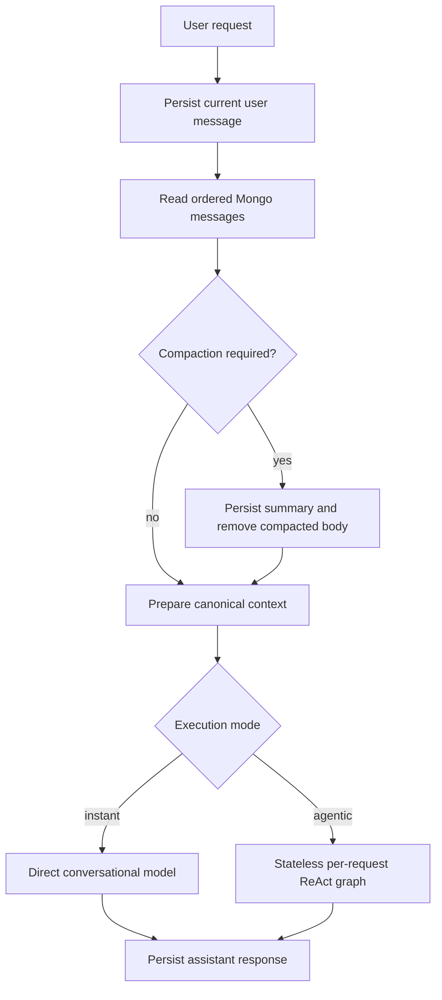

# UAW-002: Mongo-Authoritative Conversation State

## 1. Task Summary

Make MongoDB the single source of truth for conversational history in the
instant and agentic chat paths.

Remove the ReAct agent's in-process `MemorySaver`, fresh per-request
`thread_id`, and all claims that LangGraph checkpointing currently provides
cross-turn continuity.

Every conversational invocation will receive one explicitly prepared,
token-bounded history derived from persisted MongoDB messages. The current user
turn, symbol context, and language instruction must each appear exactly once.

This is the second implementation task from the
[Unified Agent Workflow Improvement Roadmap](../architecture/unified-agent-workflow-roadmap.md).

## 2. Architectural Decision

UAW-002 chooses:

```text
Mongo-authoritative conversational state
```

for:

- instant conversational responses;
- tool-backed ReAct responses;
- chat restoration;
- context compaction and persisted summaries.

It does not make MongoDB the execution checkpointer for long-running Research
Jobs. Durable graph checkpointing remains a later task because research has a
different lifecycle and benefits from stage-level resume.

### 2.1 Why MongoDB

MongoDB already:

- persists user and assistant messages;
- survives backend restarts;
- powers frontend chat restoration;
- stores summaries created by context compaction;
- is shared by v2 and v3;
- is the state users can inspect and delete.

The current LangGraph checkpointer:

- is process-local;
- is lost on restart;
- uses a new thread ID for every invocation;
- cannot resume a previous turn;
- duplicates a responsibility already owned by MongoDB.

### 2.2 Decision Consequence

Conversational continuity is implemented through:

```text
persisted messages
  -> ordered history read
  -> optional compaction
  -> canonical context preparation
  -> one stateless agent invocation
```

The ReAct graph is stateful only within one invocation while it loops through
model and tool nodes. It is not a cross-request state store.

## 3. Why This Task Is Next

UAW-001 removed a dangerous entity-resolution fallback. The next highest-risk
architectural ambiguity is state ownership.

Leaving the current implementation in place creates three problems:

1. Documentation suggests a capability that does not exist.
2. A future developer may make `thread_id` stable without removing manual
   history replay, causing every prior turn to appear twice.
3. Restart and compaction behavior cannot be reasoned about from one explicit
   contract.

The task also prepares the later v2/v3 runtime merge. A unified
Conversational Engine needs one context input regardless of whether tools are
enabled.

## 4. Current Behavior

### 4.1 ReAct Construction

`FinancialAnalysisReActAgent` currently:

```text
creates MemorySaver
  -> passes it to create_react_agent
  -> creates a fresh random thread_id per ainvoke
```

The new `thread_id` prevents the checkpointer from finding any prior state.

### 4.2 Request Context

The v3 handler currently:

```text
persist current user message
  -> read all messages from MongoDB
  -> compact if token threshold is exceeded
  -> remove the just-persisted current user message
  -> append selected-symbol instruction to a separate current message
  -> pass history and current message into ainvoke
```

Inside `ainvoke`:

```text
convert Mongo history to HumanMessage / AIMessage
  -> append language instruction to current user message
  -> invoke LangGraph with a fresh thread_id
```

The actual cross-turn state therefore comes from MongoDB, not `MemorySaver`.

### 4.3 v2 Difference

The simple assistant also reads MongoDB history and compacts it, but it leaves
the current user message inside the history because `stream_chat` consumes the
complete message list directly.

This behavior is correct for that interface, but the distinction is implicit
and easy to break.

### 4.4 Deep Research

The Deep Agent receives `conversation_history` but does not forward it into
the research graph. That is UAW-003 and is explicitly outside this task.

## 5. Problem Statement

The system has two apparent state mechanisms:

```text
MongoDB history replay
LangGraph MemorySaver
```

Only one is functional across turns.

This causes:

- misleading architecture documentation;
- unnecessary in-process memory;
- random thread identifiers with no semantic value;
- risk of duplicate context if checkpointing is later enabled;
- different context assembly logic across handlers;
- weak restart and duplicate-message test coverage;
- observability fields that imply resumable LangGraph sessions.

## 6. Goals

- Make MongoDB the explicit conversational state authority.
- Remove `MemorySaver` from the conversational ReAct graph.
- Remove per-request LangGraph `thread_id`.
- Preserve within-invocation ReAct tool loops.
- Define one canonical context-preparation contract.
- Ensure every historical turn appears exactly once.
- Ensure the current user turn appears exactly once.
- Apply symbol and language context exactly once.
- Preserve context compaction and summary persistence.
- Prove continuity after backend restart.
- Keep v2 and v3 behavior compatible.
- Correct documentation, logs, and interview claims.

## 7. Non-Goals

UAW-002 does not:

- add checkpointing to Deep Research;
- pass history into Deep Research;
- merge v2 and v3 into one engine;
- add a unified Run model;
- add human-in-the-loop resume;
- redesign MongoDB message schemas;
- introduce vector memory or semantic retrieval;
- retain hidden model reasoning;
- store LangGraph internal node state;
- create distributed conversation locks;
- solve concurrent writes to the same chat;
- change the frontend chat-list or message UI.

Those concerns belong to later roadmap tasks.

## 8. State Ownership Contract

### 8.1 MongoDB Owns

MongoDB is authoritative for:

- user-visible user messages;
- user-visible assistant messages;
- persisted tool-result messages;
- message order;
- chat UI state;
- current selected symbol fallback;
- compacted conversation summaries;
- deletion and restoration behavior.

### 8.2 Agent Invocation Owns

One agent invocation owns only:

- current ReAct graph state;
- current tool calls;
- current model messages;
- current retry state;
- current trace ID;
- transient tool event queue.

This state ends when the invocation completes, fails, times out, or is
cancelled.

### 8.3 Research Job Will Own Later

A future Research Job checkpointer will own:

- research plan;
- completed specialist stages;
- debate rounds;
- pending human clarification;
- resume cursor.

That state must not be mixed with conversational message replay.

## 9. Required Invariants

### 9.1 History Invariants

For one request:

- persisted historical user turns appear once;
- persisted historical assistant turns appear once;
- the current user turn appears once;
- no previous LangGraph checkpoint contributes messages;
- chronological order is preserved;
- deleted messages do not reappear;
- compacted body messages do not appear beside their summary.

### 9.2 Context Invariants

- `current_symbol` instruction appears at most once.
- Language instruction appears at most once.
- Summary messages are treated as context, not new user instructions.
- Tool persistence traffic does not invoke an agent.
- Empty assistant streaming placeholders are never persisted as history.
- Structured clarification metadata does not become prompt text unless its
  human-readable assistant message is part of the conversation.

### 9.3 Restart Invariants

After backend restart:

- the same chat restores the same persisted messages;
- a follow-up request receives the same effective conversation history;
- no in-memory checkpoint is required;
- the previous user and assistant turns are not duplicated.

## 10. Target Architecture



The ReAct graph is compiled without a checkpointer:

```python
create_react_agent(
    model,
    tools,
    prompt=system_prompt,
)
```

Invocation config contains:

```text
recursion_limit
callbacks
trace metadata
```

It does not contain:

```text
configurable.thread_id
```

## 11. Canonical Conversation Context

### 11.1 Proposed Contract

Introduce a typed prepared context:

```python
from dataclasses import dataclass


@dataclass(frozen=True)
class PreparedConversationContext:
    history: list[dict[str, str]]
    current_message: str
    persisted_message_count: int
    history_message_count: int
    estimated_tokens: int
    compaction_applied: bool
    symbol_source: str | None
```

The final location may be:

```text
backend/src/services/conversation_context_service.py
```

or a smaller shared helper module if the implementation remains concise.

It must not depend on FastAPI response objects or SSE formatting.

### 11.2 Inputs

The context builder receives:

```text
chat_id
current user message
current persisted messages
request current_symbol
language
context manager
message repository
```

### 11.3 Outputs

For v3:

```text
history = prior persisted turns only
current_message = current turn + symbol context
language instruction = appended inside agent boundary once
```

For v2:

The current ChatAgent API expects one complete list. During UAW-002 it may
adapt the prepared contract into:

```text
history + current message
```

without changing the model client.

The later Conversational Engine merge can remove this adapter difference.

### 11.4 Current-Turn Removal

Do not rely only on text equality:

```python
history[-1]["content"] == request.message
```

Identical consecutive user messages are valid and text equality cannot
distinguish them.

Preferred implementation:

- retain the `message_id` returned by `add_message`;
- exclude that exact ID while preparing prior history;
- or read prior history before persisting the current message if persistence
  and failure semantics remain correct.

The message-ID approach is preferred because the current user request remains
persisted even if context preparation or model invocation later fails.

## 12. Backend Implementation Scope

### 12.1 Remove Decorative LangGraph Memory

Modify:

```text
backend/src/agent/langgraph_react_agent.py
```

Remove:

- `MemorySaver` import;
- `self.checkpointer`;
- `checkpointer=` from `create_react_agent`;
- random per-request `thread_id`;
- `configurable.thread_id` invocation config;
- logs and Langfuse metadata that imply a conversation thread;
- module documentation claiming built-in cross-turn memory.

Keep:

- unique `trace_id`;
- within-request graph state;
- recursion limit;
- callbacks;
- retry and zero-tool behavior.

### 12.2 Separate Trace Identity From Conversation Identity

Use:

```text
trace_id = unique execution identifier
chat_id = persistent conversation identifier
```

Do not create a third identifier called `thread_id` unless a future durable
checkpointer gives it real semantics.

The agent interface may optionally receive `chat_id` for logs and tracing, but
it must not use that value to restore LangGraph state.

### 12.3 Canonical Context Preparation

Extract duplicated context preparation from v2 and v3:

- ordered Mongo read;
- token calculation;
- optional compaction;
- exact current-message exclusion;
- selected-symbol resolution;
- history conversion.

The handler remains responsible for:

- persistence order;
- SSE lifecycle;
- invoking the selected engine;
- saving the assistant response.

### 12.4 Message Identity

`ChatService.add_message` already returns the persisted `Message`. Handlers
should retain:

```python
current_message = await chat_service.add_message(...)
```

and pass `current_message.message_id` to context preparation.

This prevents accidental removal of an earlier identical user turn.

### 12.5 Summary Handling

Context compaction currently:

1. summarizes the body;
2. persists an assistant summary message;
3. deletes old body messages;
4. reconstructs an effective context.

UAW-002 must make this behavior explicit and idempotent.

Required:

- one compaction action per threshold crossing;
- no summary duplicated in the same invocation;
- summary message appears once in future history;
- retained head and tail order remains deterministic;
- current message is never deleted by compaction;
- compaction failure surfaces according to existing error policy and does not
  silently discard history.

### 12.6 History Role Mapping

The canonical mapper must define:

```text
user -> HumanMessage
assistant -> AIMessage
system summary -> explicit summary context policy
tool-source persisted message -> documented inclusion or exclusion
```

The current system stores summaries as assistant messages. UAW-002 should keep
that behavior for compatibility unless tests prove a role change is required.

### 12.7 Context Logging

Replace thread-oriented logging with:

```text
chat_id
trace_id
context_source=mongodb
persisted_message_count
history_message_count
current_message_id
estimated_context_tokens
compaction_applied
summary_used
symbol_source
```

Do not log complete message bodies.

## 13. Frontend Scope

No normal UI redesign is required.

The frontend must continue to:

- send `chat_id` on follow-up turns;
- restore MongoDB messages after reload;
- preserve selected symbol UI state;
- show the same conversation after backend restart.

Optional debug-only visibility may expose:

```text
context source: MongoDB
```

but this is not required for the normal product UI.

## 14. API Compatibility

No public endpoint change is required.

The existing request remains:

```json
{
  "message": "What changed since the previous analysis?",
  "chat_id": "chat_123",
  "current_symbol": "SKHY",
  "language": "zh-CN",
  "agent_version": "auto"
}
```

Explicit v2/v3 overrides remain temporary debugging compatibility.

No migration is required for persisted messages.

## 15. Data Migration

There is no LangGraph checkpoint data to migrate because `MemorySaver` is
in-process and ephemeral.

MongoDB messages remain unchanged.

The implementation should not:

- rewrite conversation history;
- backfill thread identifiers;
- add synthetic checkpoint documents;
- modify existing chat IDs.

## 16. Failure and Restart Semantics

### 16.1 Model Failure

If the model fails:

- the user message remains persisted;
- no assistant success message is invented;
- retrying in the same chat sees the failed user request in history;
- the next request must not include the retried current message twice.

Whether failed user turns should later be marked with run status belongs to
the unified Run model task.

### 16.2 Backend Restart

After restart:

- MongoDB provides all conversational state;
- ReAct agent recompilation creates an empty per-process graph;
- follow-up behavior remains continuous;
- no restoration hook is needed in the agent constructor.

### 16.3 Compaction Failure

Do not delete messages unless summary persistence succeeds.

If summary generation fails and the existing fallback summary succeeds, persist
that fallback according to current policy.

If compaction cannot produce safe context, surface an explicit error rather
than invoking the model with silently truncated history.

## 17. Observability Requirements

Minimum structured fields:

```text
trace_id
chat_id
context_source
current_message_id
history_message_count
estimated_context_tokens
compaction_applied
summary_message_count
```

Remove or stop emitting:

```text
thread_id
checkpointer=MemorySaver
conversation continuity via LangGraph memory
```

Metrics:

- history messages per request;
- context tokens before and after compaction;
- compaction count;
- summary reuse count;
- duplicate-current-turn prevention count;
- restart-continuity test result.

## 18. Detailed Implementation Steps

### Phase 1: Pin Current Semantics

- [ ] Add tests capturing the exact v2 and v3 message sequences.
- [ ] Add a regression case with identical consecutive user messages.
- [ ] Add a regression case for current-symbol instruction count.
- [ ] Add a regression case for language instruction count.
- [ ] Add a restart-continuity integration fixture.

### Phase 2: Remove LangGraph Memory

- [ ] Remove `MemorySaver`.
- [ ] Compile ReAct graph without a checkpointer.
- [ ] Remove random `thread_id`.
- [ ] Remove thread ID from config, logs, and traces.
- [ ] Update docstrings and architecture documentation.

### Phase 3: Canonical Context Builder

- [ ] Retain the current persisted message ID.
- [ ] Build prior history by ID rather than text equality.
- [ ] Centralize compaction and symbol-context preparation.
- [ ] Return a typed prepared-context result.
- [ ] Adapt v2 and v3 to the same prepared context.

### Phase 4: Restart and Failure Tests

- [ ] Recreate the backend agent and service against the same MongoDB.
- [ ] Verify follow-up context survives.
- [ ] Verify failed-turn retry has no duplicated message.
- [ ] Verify summaries survive process recreation.

### Phase 5: Playwright Evidence

- [ ] Add deterministic multi-turn browser scenario.
- [ ] Add page reload and chat-restoration scenario.
- [ ] Add two-phase backend restart scenario.
- [ ] Capture curated screenshots after assertions pass.

### Phase 6: Documentation and Release

- [ ] Update this feature status and version.
- [ ] Update architecture overview.
- [ ] Correct Agent 12-Factors claims.
- [ ] Add a state-authority case study.
- [ ] Update backend changelog and version.

## 19. Test Plan

### 19.1 Message-Content Unit Tests

Create or extend tests for a pure context builder.

Cases:

1. Empty chat produces empty history.
2. One current user message is excluded from v3 prior history by message ID.
3. Two identical consecutive user messages retain the older message.
4. Historical order is preserved.
5. User and assistant roles map correctly.
6. Symbol instruction appears once.
7. Language instruction appears once.
8. Tool persistence requests do not invoke context preparation.
9. Structured clarification assistant text remains available as history.
10. Deleted messages do not appear.

### 19.2 ReAct Construction Tests

Cases:

- `create_react_agent` receives no checkpointer;
- agent has no `MemorySaver` field;
- invocation config contains no thread ID;
- trace IDs remain unique;
- recursion limit and callbacks remain configured;
- one invocation still supports multiple tool calls.

### 19.3 Context Compaction Tests

Cases:

- below threshold: no summary write or deletion;
- above threshold: one summary and deterministic retained tail;
- repeated invocation: existing summary is reused once;
- summary persistence failure: old messages are not deleted;
- current message is never compacted away;
- token count after compaction meets target;
- backend recreation reads the persisted summary.

### 19.4 Handler Tests

#### v2

- persists user message;
- sets title;
- builds Mongo history once;
- streams response;
- persists assistant response.

#### v3

- persists user message and retains its ID;
- prior history excludes only that ID;
- invokes ReAct with no duplicated current turn;
- tool events remain unchanged;
- timeout and model error preserve user history.

### 19.5 MongoDB Integration Tests

Use an actual test MongoDB:

1. Create chat.
2. Persist first user and assistant turn.
3. Dispose service and agent instances.
4. Construct new instances.
5. Prepare a follow-up context.
6. Assert first turn is present exactly once.
7. Assert no checkpointer state was needed.

Repeat with a compacted conversation.

## 20. Playwright End-to-End Plan

### 20.1 Test Infrastructure

Extend the existing E2E Compose profile with a deterministic
Anthropic-compatible LLM stub:

```text
llm-e2e
```

The stub should support:

- normal message responses;
- streaming text events for v2;
- deterministic codeword recall from prior messages;
- request capture for duplicate-message assertions;
- no external network or API key.

The E2E backend uses:

```text
LLM_PROVIDER=anthropic
ANTHROPIC_BASE_URL=http://llm-e2e:<port>
ANTHROPIC_API_KEY=dummy
ANTHROPIC_MODEL=e2e-model
```

### 20.2 Deterministic Multi-Turn Scenario

From the visible frontend:

1. Open Platform.
2. Send:

   ```text
   Remember the exact codeword ORBIT-742 and acknowledge it.
   ```

3. Send:

   ```text
   What exact codeword did I give you?
   ```

4. Assert the assistant displays `ORBIT-742`.
5. Inspect the LLM-stub request and assert each prior turn appears once.

### 20.3 Reload and Restoration Scenario

1. Complete the first turn.
2. Reload the browser.
3. Select the persisted chat.
4. Send the follow-up.
5. Assert the codeword is recalled.
6. Assert no duplicate user bubble appears.

### 20.4 Backend Restart Scenario

Use a two-phase Playwright command:

```text
phase A: create chat and persist codeword
restart backend-e2e
phase B: restore chat and ask for codeword
```

The orchestration command owns the restart:

```bash
make test-e2e-uaw002
```

It should:

1. start isolated MongoDB, Redis, LLM stub, backend, frontend, and Chromium;
2. run seed phase;
3. restart only backend;
4. run resume phase;
5. preserve the E2E Mongo volume between phases;
6. remove temporary state afterward.

### 20.5 Screenshot Evidence

Save:

```text
docs/features/assets/uaw-002/
  01-multi-turn-context-once.png
  02-chat-restored-after-reload.png
  03-context-survives-backend-restart.png
  04-identical-user-turns-not-dropped.png
```

Evidence table when shipped:

| Evidence | Scenario | Stack | Commit | Result |
| --- | --- | --- | --- | --- |
| `01-multi-turn-context-once.png` | Follow-up recalls prior turn | Real frontend/backend + deterministic LLM stub | TBD | PASS |
| `02-chat-restored-after-reload.png` | Reloaded chat retains context | Real frontend/backend + deterministic LLM stub | TBD | PASS |
| `03-context-survives-backend-restart.png` | Backend restart does not lose conversation | Two-phase real stack | TBD | PASS |
| `04-identical-user-turns-not-dropped.png` | Identical prior turn remains while current ID is excluded | Real backend + browser UI | TBD | PASS |

Screenshots are captured only after assertions pass.

## 21. Validation Commands

Targeted backend:

```bash
cd backend
python -m pytest \
  tests/test_conversation_context.py \
  tests/test_context_window_manager.py \
  tests/test_simple_agent_streaming.py \
  tests/test_react_agent_streaming.py \
  tests/test_chat_service.py
python -m ruff check \
  src/agent/langgraph_react_agent.py \
  src/services/conversation_context_service.py \
  src/api/chat
python -m black --check \
  src/agent/langgraph_react_agent.py \
  src/services/conversation_context_service.py \
  src/api/chat
```

Playwright:

```bash
make test-e2e-uaw002
```

Full validation:

```bash
make fmt
make test
make lint
```

Runtime verification:

```bash
curl -N -X POST http://localhost:18080/api/chat/stream \
  -H "Content-Type: application/json" \
  -d '{
    "message": "What did I ask in the previous turn?",
    "chat_id": "<existing-chat-id>",
    "agent_version": "v3",
    "language": "en"
  }'
```

## 22. Acceptance Criteria

The task is complete when:

- [ ] MongoDB is documented and implemented as the conversational state
      authority.
- [ ] ReAct agent construction contains no `MemorySaver`.
- [ ] ReAct invocation contains no `thread_id`.
- [ ] Cross-turn history comes only from persisted MongoDB messages.
- [ ] Prior turns appear exactly once.
- [ ] Current user turn appears exactly once.
- [ ] Identical consecutive user messages are handled by message ID, not text
      equality.
- [ ] Symbol instruction appears at most once.
- [ ] Language instruction appears at most once.
- [ ] v2 and v3 share a canonical context-preparation contract.
- [ ] Context compaction remains correct and persistent.
- [ ] Backend restart preserves conversational continuity.
- [ ] Clarification and failed turns remain visible after restart.
- [ ] Logs and docs no longer claim conversational continuity from LangGraph
      memory.
- [ ] Playwright multi-turn, reload, and backend-restart scenarios pass.
- [ ] Four screenshot artifacts are linked from this document.
- [ ] Targeted and full repository checks pass.

## 23. Risks and Mitigations

| Risk | Impact | Mitigation |
| --- | --- | --- |
| Removing checkpointer changes within-turn tool behavior | ReAct regression | Verify multi-tool loop tests before and after removal |
| Current message appears twice | Confused model and repeated answers | Exclude by persisted message ID |
| Identical previous message is removed accidentally | Lost context | Regression test two identical consecutive turns |
| Summary appears beside deleted body | Duplicated historical facts | Integration tests around compaction persistence |
| Context builder becomes another oversized abstraction | Delays unified engine work | Keep it focused on persisted message preparation only |
| E2E relies on external model behavior | Flaky validation | Add deterministic Anthropic-compatible stub |
| Backend restart test loses database state | False failure | Restart only backend and preserve isolated Mongo volume |
| Removing thread ID harms Langfuse grouping | Trace discoverability loss | Correlate with `chat_id` and unique `trace_id` |
| Existing docs still claim MemorySaver continuity | Interview credibility issue | Repo-wide search and documentation update |

## 24. Rollout

This is an internal behavior-preserving change.

Rollout:

1. Add tests that pin current effective Mongo behavior.
2. Remove MemorySaver and thread IDs.
3. Introduce canonical context preparation.
4. Run deterministic and real-stack restart tests.
5. Restart local backend.
6. Test follow-up questions in existing chats.

No feature flag is required because there is no functional checkpoint behavior
to preserve.

## 25. Rollback

Code can be reverted without data migration because MongoDB message documents
are unchanged.

Do not respond to a regression by merely restoring a stable LangGraph
`thread_id`; that would combine checkpoint state with Mongo replay and risk
duplicated context.

If rollback is necessary, restore the complete previous invocation model while
keeping the duplicate-message regression tests visible.

## 26. Dependencies

Required:

- MongoDB chat and message repositories;
- existing context-window manager;
- current chat restoration flow;
- existing Playwright E2E profile;
- UAW-001 clarification persistence.

Not required:

- Deep Research checkpointing;
- unified Run model;
- Langfuse;
- external vector database;
- cloud deployment;
- multi-user authentication.

## 27. Follow-Up Tasks

After UAW-002:

1. **UAW-003**: Pass structured conversation context into the Research Job.
2. Add durable Research Job checkpoints.
3. Merge v2 and v3 behind the unified Conversational Engine.
4. Add run-state metadata for failed and cancelled turns.
5. Add concurrency control for simultaneous requests in one chat.

## 28. Implementation Deliverables

Expected change set:

```text
Backend:
  MemorySaver and thread-id removal
  canonical conversation context builder
  message-ID based current-turn exclusion
  context and restart tests
  updated tracing fields

E2E:
  deterministic Anthropic-compatible test stub
  two-phase backend-restart Playwright command
  multi-turn and reload specs
  four screenshot artifacts

Documentation:
  shipped feature spec
  architecture overview corrections
  Agent 12-Factors corrections
  case study
  backend changelog and version
```

