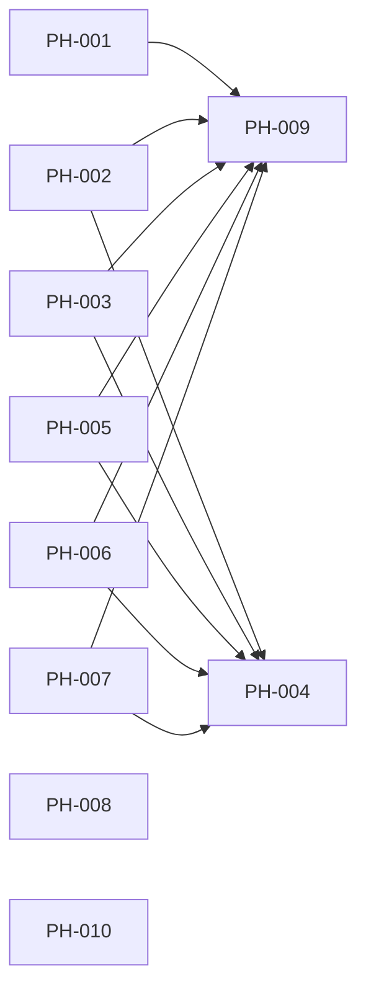

# PH-000: Project Hardening Program

## Goal

Turn the project review findings into independently executable work packages
with explicit ownership, contracts, validation, browser evidence, and merge
order. No task may be marked `shipped` merely because unit tests pass.

## Parallel Assignment

| Agent | Task | Parallel group | Main ownership |
| --- | --- | --- | --- |
| A | [PH-001 Local Network Perimeter](project-hardening-local-network-perimeter.md) | Wave 1 | Compose and local connectivity |
| B | [PH-002 Insights Prefetch Contract](project-hardening-insights-prefetch-contract.md) | Wave 1 | Insights/DataManager contract |
| C | [PH-003 Backend Type Safety](project-hardening-backend-type-safety.md) | Wave 1 | Backend typing and domain contracts |
| D | [PH-004 CI Agent Quality Gates](project-hardening-ci-agent-quality-gates.md) | Wave 1 | CI, eval, deterministic E2E |
| E | [PH-005 Untrusted Markdown Safety](project-hardening-markdown-safety.md) | Wave 1 | Chat rendering security |
| F | [PH-006 Frontend Type and Lint Boundary](project-hardening-frontend-quality.md) | Wave 1 | API/SSE typing and warning budget |
| G | [PH-007 Agent Orchestration Coverage](project-hardening-agent-orchestration-coverage.md) | Wave 1 | Composition and workflow tests |
| H | [PH-008 Reproducible Runtime Builds](project-hardening-reproducible-builds.md) | Wave 1 | Dockerfiles and dependency locks |
| I | [PH-009 Source Decomposition](project-hardening-source-decomposition.md) | Wave 2 | Oversized source modules |
| J | [PH-010 Version and Documentation Metadata](project-hardening-version-metadata.md) | Wave 1 | Runtime version source and docs |

## Dependency and Merge Graph



Wave 1 tasks may use separate worktrees. PH-009 starts only after the functional
and typing changes land because moving large modules first would create broad
merge conflicts. PH-004 may prepare CI in parallel but must merge after the
gates it enables are green on the integrated branch.

## Shared Rules for Every Agent

1. Rebase on the latest integration branch before final validation.
2. Stay inside the paths listed in the task's ownership section. Coordinate any
   cross-owned edit before making it.
3. Add or update the feature spec before implementation and keep its status at
   `in-progress` until all acceptance evidence exists.
4. Run targeted tests first, then the full relevant quality gates.
5. Any browser-observable or frontend-to-backend behavior requires Playwright.
6. Save curated screenshots under `docs/features/assets/ph-00x/` only after
   assertions pass. Raw reports remain uncommitted.
7. Record scenario, assertion, tested commit, and mock/real-stack mode in the
   task document.
8. Update component version, changelog, indexes, and a bilingual case study.
9. Use two commits: implementation, then shipment documentation containing the
   implementation hash.
10. Do not mark a task `shipped` until its required E2E and screenshot evidence
    are committed.

## Integration Validation

After all Wave 1 tasks merge:

```bash
make fmt
make test
make lint
make eval
make test-e2e
```

Then execute all task-specific real-stack Playwright scenarios. PH-009 must run
the same suite after decomposition to prove behavior preservation.

## Current Execution Record

Active continuation notes are maintained in
[Project Hardening Active Handoff](../development/hardening-handoff.md).

Wave 1 started on 2026-08-06 and is now shipped. PH-003/007 established strict
backend types and composition coverage, PH-006 the frontend typed/lint boundary,
and PH-008 reproducible non-root runtime builds. The first tranche was `960d29a`;
PH-008 implementation was `4742bc8`.

## 2026-09-14 Closeout and Hosted CI Shipment

**PH-001/002/004/005/010 are shipped** at backend `0.51.5` / frontend `0.32.5`.
Implementation `db1e4b8739c21fb160e6eadda65dab53617522aa`, evidence `a115fd2`, and CI
compatibility/probes `1e78a4a` merged through protected
[PR #1](https://github.com/fhw12345/FinancialAgent/pull/1), merge
`7cc3789b291cfb71865d3cb7a368a965957db5ca`.

The closeout includes Markdown-image safety, real snapshot/shared-input
consumption, Redis dedup failure handling and historical-compatible eval provenance.
Two clean builds produced identical installed dependency manifests and frontend
assets; six fresh-image smoke cases and eleven default regressions passed.

Actual hosted PR gates passed, deliberate mypy/eval/Playwright failures preserved
reports/traces, and a final normal rerun passed. Main requires the GitHub Actions
`Unit Tests` check, strictly up to date and enforced for administrators. See
[PH-004 hosted receipts](assets/ph-004/hosted-ci-validation.json), the
[closeout case study](../case-studies/2026-09-09-closeout-checklists-are-not-evidence.md)
and [hosted CI case study](../case-studies/2026-09-14-hosted-ci-needs-failure-proof.md).

Nine of ten tasks are shipped. **PH-009 remains planning and has not started**;
the overall program is still in progress. Production lint remains zero-warning,
with the unchanged 131-warning test/E2E budget. The integrated baseline is ready,
but the maintainer explicitly paused PH-009 on 2026-09-14. The new
[Investment Decision Quality Program](investment-decision-quality-program.md)
records Agent/investment improvements as plans only; it does not authorize runtime
implementation or resume source decomposition.

## Program Acceptance Criteria

- [ ] All ten task documents have complete implementation and test records.
- [x] No host service is exposed beyond loopback by default.
- [x] Insights shared prefetch executes with the real DataManager contract.
- [x] Backend mypy reports zero errors.
- [x] CI enforces typing, deterministic eval, and deterministic browser tests.
- [x] Untrusted agent output cannot render arbitrary HTML.
- [x] Frontend warnings are bounded and API/SSE boundaries contain no `any`.
- [x] Critical orchestration paths have composition-level tests.
- [x] Runtime builds are reproducible from committed dependency metadata.
- [ ] Production source files comply with the 500-line policy.
- [x] Runtime and documentation versions have one authoritative source.
