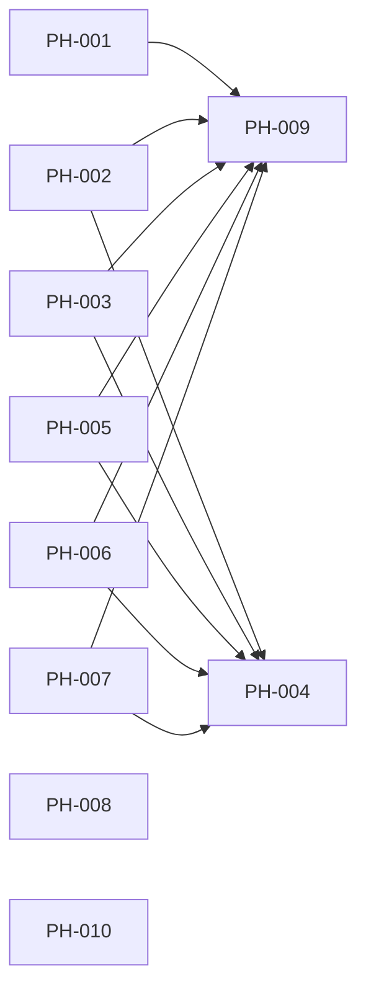

# PH-000: Project Hardening Program

## Goal

Turn the project review findings into independently executable work packages
with explicit ownership, contracts, validation, browser evidence, and merge
order. No task may be marked `shipped` merely because unit tests pass.

## Parallel Assignment

| Agent | Task | Parallel group | Main ownership |
| --- | --- | --- | --- |
| A | [PH-001 Local Network Perimeter](project-hardening-local-network-perimeter.md) | Wave 1 | Compose and local connectivity |
| B | [PH-002 Insights Prefetch Contract](project-hardening-insights-prefetch-contract.md) | Wave 1 | Insights/DataManager contract |
| C | [PH-003 Backend Type Safety](project-hardening-backend-type-safety.md) | Wave 1 | Backend typing and domain contracts |
| D | [PH-004 CI Agent Quality Gates](project-hardening-ci-agent-quality-gates.md) | Wave 1 | CI, eval, deterministic E2E |
| E | [PH-005 Untrusted Markdown Safety](project-hardening-markdown-safety.md) | Wave 1 | Chat rendering security |
| F | [PH-006 Frontend Type and Lint Boundary](project-hardening-frontend-quality.md) | Wave 1 | API/SSE typing and warning budget |
| G | [PH-007 Agent Orchestration Coverage](project-hardening-agent-orchestration-coverage.md) | Wave 1 | Composition and workflow tests |
| H | [PH-008 Reproducible Runtime Builds](project-hardening-reproducible-builds.md) | Wave 1 | Dockerfiles and dependency locks |
| I | [PH-009 Source Decomposition](project-hardening-source-decomposition.md) | Wave 2 | Oversized source modules |
| J | [PH-010 Version and Documentation Metadata](project-hardening-version-metadata.md) | Wave 1 | Runtime version source and docs |

## Dependency and Merge Graph



Wave 1 tasks may use separate worktrees. PH-009 starts only after the functional
and typing changes land because moving large modules first would create broad
merge conflicts. PH-004 may prepare CI in parallel but must merge after the
gates it enables are green on the integrated branch.

## Shared Rules for Every Agent

1. Rebase on the latest integration branch before final validation.
2. Stay inside the paths listed in the task's ownership section. Coordinate any
   cross-owned edit before making it.
3. Add or update the feature spec before implementation and keep its status at
   `in-progress` until all acceptance evidence exists.
4. Run targeted tests first, then the full relevant quality gates.
5. Any browser-observable or frontend-to-backend behavior requires Playwright.
6. Save curated screenshots under `docs/features/assets/ph-00x/` only after
   assertions pass. Raw reports remain uncommitted.
7. Record scenario, assertion, tested commit, and mock/real-stack mode in the
   task document.
8. Update component version, changelog, indexes, and a bilingual case study.
9. Use two commits: implementation, then shipment documentation containing the
   implementation hash.
10. Do not mark a task `shipped` until its required E2E and screenshot evidence
    are committed.

## Integration Validation

After all Wave 1 tasks merge:

```bash
make fmt
make test
make lint
make eval
make test-e2e
```

Then execute all task-specific real-stack Playwright scenarios. PH-009 must run
the same suite after decomposition to prove behavior preservation.

## Current Execution Record

Active continuation notes are maintained in
[Project Hardening Active Handoff](../development/hardening-handoff.md).

Wave 1 implementation started on 2026-08-06. PH-001, PH-002, PH-005, and
PH-010 have code and passing task-specific Playwright evidence. PH-004 remains
open for CI-hosted evidence. PH-003 and PH-007 are shipped at backend
`0.51.3`, PH-006 is shipped at frontend `0.32.3`, and PH-008 is shipped at
backend `0.51.4` / frontend `0.32.4` after resolving the package-registry TLS
blocker with lock-preserving transport mirrors, two clean builds, and
fresh-image Playwright evidence. PH-009 remains open and the program is not
shipped. The first hardening tranche is recorded in implementation commit
`960d29a`; PH-008 shipped in implementation commit `4742bc8`.

## 2026-09-09 Closeout / CI Continuation (Unpublished)

PH-001/002/005/010 now meet their local contract/browser checks, including
Markdown-image safety, real snapshot refresh/shared-input consumption, Redis dedup
failure handling, and historical-compatible eval provenance. They remain
`in-progress` pending hosted CI and publication. PH-004's local security/policy
gates are green after tested XML/SHA1 fixes; its six-case fresh-image real-API
smoke and eleven-case default regression suite pass. Two final clean builds have
identical complete installed manifests and frontend assets. Git transport push
succeeded, but gh API authorization is unavailable; no real PR run or final
shipment is claimed.
The 131 test/E2E warnings are retained as a non-increasing follow-up budget;
production lint remains zero-warning. PH-009 has not started.

Versions `0.51.5` / `0.32.5` describe candidate implementation
`db1e4b8739c21fb160e6eadda65dab53617522aa`, committed with evidence and pushed on
`hardening/closeout-ci`. The last published main versions remain `0.51.4` /
`0.32.4`. See the
[closeout case study](../case-studies/2026-09-09-closeout-checklists-are-not-evidence.md).

## Program Acceptance Criteria

- [ ] All ten task documents have complete implementation and test records.
- [ ] No host service is exposed beyond loopback by default.
- [ ] Insights shared prefetch executes with the real DataManager contract.
- [ ] Backend mypy reports zero errors.
- [ ] CI enforces typing, deterministic eval, and deterministic browser tests.
- [ ] Untrusted agent output cannot render arbitrary HTML.
- [ ] Frontend warnings are bounded and API/SSE boundaries contain no `any`.
- [ ] Critical orchestration paths have composition-level tests.
- [ ] Runtime builds are reproducible from committed dependency metadata.
- [ ] Production source files comply with the 500-line policy.
- [ ] Runtime and documentation versions have one authoritative source.
